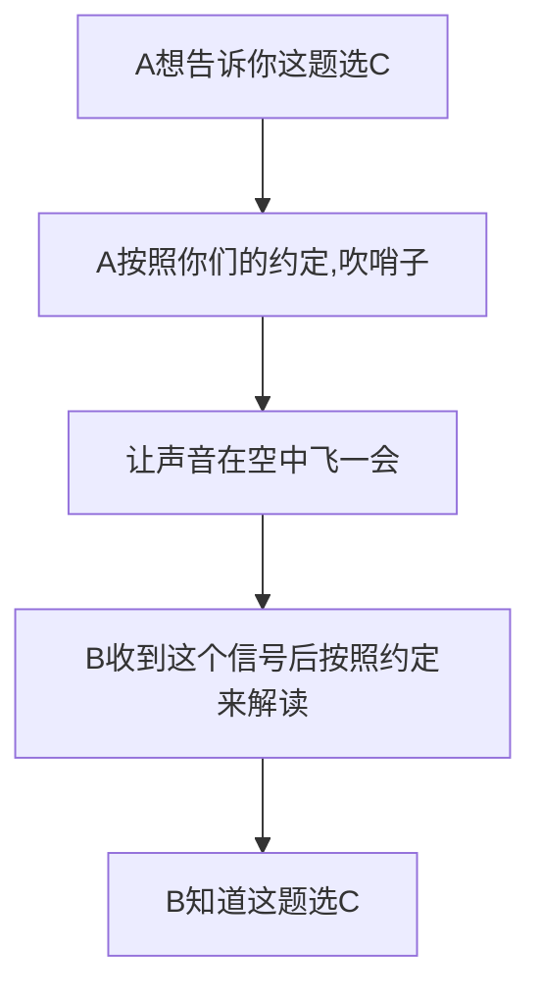
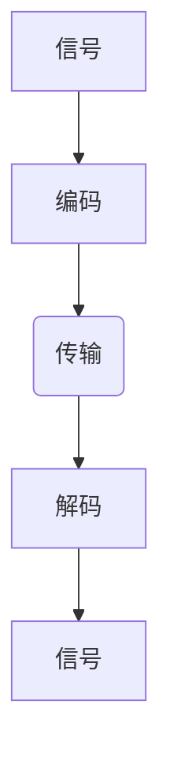

# [首页<<](../../index.html)

<meta name="viewport" content="width=device-width, initial-scale=1.0">
<meta name="keywords" content="串口通讯,bigonion,RS232,RS232协议,示波器" />
<meta name="author" content="bigonion,bigonion@bigonion.cn">
<meta name="description"
content="Bigonion的个人主页,博客,其实第一次听说串口通讯的时候是很迷茫的,第一次接触是在微嵌实验课上,使用 ARM 汇编来与上位机`(你可以认为电脑是上位机的一种)`进行通讯,然后那时候对什么波特率也不了解,直到很久之后的通用电子测量实验才算有所了解,下面我将会从易于初学者（其实需要一些基础知识）理解的角度触发,一起走进 RS232 串口通讯的世界">

# 什么是 RS232 串口通讯?

---

## 前言

其实第一次听说串口通讯的时候是很迷茫的,第一次接触是在微嵌实验课上,使用 ARM 汇编来与上位机`(你可以认为电脑是上位机的一种)`进行通讯,然后那时候对什么波特率也不了解,直到很久之后的通用电子测量实验才算有所了解,下面我将会从易于初学者（其实需要一些基础知识）理解的角度触发,一起走进 RS232 串口通讯的世界

---

## 什么是串口?

串口通讯就是两个设备进行通讯交换数据的一个协议方式,我们常用的 USB 设备也是串口的一种,我们常见的协议有下面三种

- UART： 全双工、异步通信
- SPI ： 全双工、同步通信
- I2C： 半双工、同步通信

关于全双工半双工请见==>[什么是全双工半双工](https://zhuanlan.zhihu.com/p/361655746)

关于同步通讯和异步通讯的优缺点对比==>[同步通讯异步通讯的优缺点](https://blog.csdn.net/zf2014122891/article/details/84557098)

我的理解是：
+ 同步传输对时间**要求严苛**,整体速度完全取决于整个通讯系统中最慢的一环,同时容易阻塞线程,我们可以类比TCP通讯协议,我们发送报文给对方**必须要等到对方答复我们**,才会继续进行下一步的交流沟通（即发送下一比特数据,并保证位、比特同步）,时间开销比较大
<br>

+ 异步传输,指的是我们不需要等待对方答复的情况下,就能够一直发送数据,虽然异步传输不需要时间同步,但是需要保证**波特率一致**,且对硬件资源消耗很大,主要是每一个字符数据都要有多余的协议比特位,即标志数据位的数据开始和结束的地方（甚至有可能有校验位）
优点是不需要时钟参与,且不会阻塞线程,但是不利于找到故障发生处,如CAN总线挂载很多设备的情况


今天我们主要来研究UART中的一种协议,RS232协议

## 什么是波特率？
什么是波特率？为什么他很重要？  
说到这个问题,就不得不提及编码了,调制或者说编码,在我们生活中无处不在

我们知道为了传输信号,我们要通过对实际传输形式的某个属性和我们要发送的数据做一个映射关系,举个例子：

B的**模式识别**期末考试快要挂科了,恰好这次考试只有选择题
于是好哥们A要给B考试打暗号
A和B 一商量 A说：
考试的时候,我
**拍桌子就选A**,**踢椅子就选B**
**吹哨子就选C**,**咳嗽子就选D**
我们列个关系表
|动作 |选项|
|--|--|
|拍桌子|A|
|踢椅子|B|
|吹哨子|C|
|咳嗽子|D|

这就是一种行为和信息之间的编码了,你可以把你们这种协议起个名字,叫做ZSBM编码（噪声编码）,~~然后发一篇SCI论文~~


下面是你们舞弊的流程图
<center>


</center>
即为

<center>



</center>
我们知道计算机只能读取0和1,所以我们通过对行为和01直接按的编码,来传输信息

如果我们再进一步,把咳嗽与二进制之间再映射一次

|数据 |选项|
|--|--|
|00|A|
|01|B|
|10|C|
|11|D|

如果你们在1s内就完成了一次答案传输过程（即告密了一题）,那么这时候你们的比特率就是2bit/s,因为你们在1s内传输了俩个比特位,但实际上你们只传输了一个动作/符号,就是这一题的答案,所以你们的波特率是1B/s,**但请注意,波特率完全取决于信号具体传输的形式**,请看视频`重要`-->[波特率和比特率到底是什么？](https://www.bilibili.com/video/BV1e84y1y7RF/?spm_id_from=333.337.search-card.all.click&vd_source=347109678632e4593a175ba64105c5ff)


所以,我们把传输符号的速率,叫做**波特率**,单位是Baud

## 进入正文

我们来看看RS232的协议是怎么说的
大致的数据结构如下

|起始位|数据位1|...|数据位8|停止位|停止位|空闲位(不限)|
|--|--|--|--|--|--|--|--|--|
|0|1/0|1/0|1/0|1|1|1|


其中数据位倒序发送,即如果要发送
11000 则需要变成 00011
这里不考虑校验位的情况
且RS232是负逻辑,需要在最后发送时全部翻转电平,其实协议部分非常简单

这里假设数据采用ASCII编码
我们发送的数据为`Hello world!`
`Hello world!`的16进制ASCII码为


|H|e|l|l|o||w|o|r|l|d|!|
|:--:|:--:|:--:|:--:|:--:|:--:|:--:|:--:|:--:|:--:|:--:|:--:|
|48|65|6C|6C|6F|20|77|6F|72|6C|64|21|


我们转成2进制


|H|e|l|l|o||w|o|r|l|d|!|
|:--:|:--:|:--:|:--:|:--:|:--:|:--:|:--:|:--:|:--:|:--:|:--:|
|48|65|6C|6C|6F|20|77|6F|72|6C|64|21|
|01001000|01100101|01101100|01101100|01101111|00100000|01110111|01101111|01110010|01101100|01100100|00100001|

拿H举例子,给H反序从01001000变成00010010,再在前面加上起始位0,结尾加上结束位1
变成  
`0 01001000 1`

由于RS232是负逻辑0用正电平表示1用负电平表示,所以我们实际发送的数据需要反向
变成
`1 10110111 0`

百闻不如一见,只有亲眼见到才知道是什么,所以我们用esp8266 NodeMcu写了一个串口循环发送程序
```jsx
#include <SoftwareSerial.h>

//自定义串口 (RX, TX)
SoftwareSerial MySerial(D5, D6);

void setup() {
  MySerial.begin(9600);
//   定义波特率9600
}

void loop() {
  delay(100);
//   延迟100ms发送
  MySerial.print("Hello world!");

}
```

这样单片机就以9600的波特率,每隔100ms,由RX和TX口向外发送数据了,我们用示波器正接入TX口,负接RX口

我们用示波器的缩放时基功能可以观察到单片机用串口发送的一段波形


我们可以清楚的看到$\Delta \mathrm{X} = 823.00000\rm{\mu s}$
在这里我们的波特率因为具体的传输形式是0和1,所以此时,波特率=比特率
我们用8次的总时间来计算一个比特位传输的时间
$$\frac{1}{832/8}=9615.38 \space \rm{B}/s$$
可以看到,8次数据传输时间的波特率与设定的9600B/s非常接近,我们继续移动分析里面的数据
~~等等,我好像,接反了呜呜呜呜,测的时候没注意~~
我事后才发觉当时接反了RX和TX,所以这里看到的电压全都是0和-2v/div
欸,所以这里显示的数据看起来就像正逻辑了,我的错😅
我们接着一个字符一个字符的看吧,就当他是正逻辑好了
从头开始

|起始位|数据位(反序)|ASCII|中止位|
|--|--|--|--|
|0|01001000|H|1|


|起始位|数据位(反序)|ASCII|中止位|
|--|--|--|--|
|0|01100101|e|1|


|起始位|数据位(反序)|ASCII|中止位|
|--|--|--|--|
|0|01101100|l|1|


|起始位|数据位(反序)|ASCII|中止位|
|--|--|--|--|
|0|01101100|l|1|


|起始位|数据位(反序)|ASCII|中止位|
|--|--|--|--|
|0|01101111|o|1|


|起始位|数据位(反序)|ASCII|中止位|
|--|--|--|--|
|0|00100000|(空格)|1|


|起始位|数据位(反序)|ASCII|中止位|
|--|--|--|--|
|0|01110111|w|1|


|起始位|数据位(反序)|ASCII|中止位|
|--|--|--|--|
|0|01101111|o|1|


|起始位|数据位(反序)|ASCII|中止位|
|--|--|--|--|
|0|01110010|r|1|


|起始位|数据位(反序)|ASCII|中止位|
|--|--|--|--|
|0|01101100|l|1|


|起始位|数据位(反序)|ASCII|中止位|
|--|--|--|--|
|0|01100100|d|1|


|起始位|数据位(反序)|ASCII|中止位|
|--|--|--|--|
|0|00100001|!|1|

每一位数据都和发送的数据一一对应上了!
如果我没接错的话这里应该看着是负逻辑才对,所以我们可以得知,esp8266 NodeMcu这款单片机所用的的确是UART RS232串口通讯协议!!

---

## 总结

纸上得来终觉浅, 我们在示波器上见证了比特的流动, 对通讯协议以及数据帧的理解更为深刻,

其实数据说到底都是一串0和1组成的,不过是经过了各种各样的编码方式,比如RS485,传输差分信号,这些变体的形式能够降低外界电磁干扰以及减少自身对外界的干扰

其实只要深入了解了技术发展的过程,以及为什么要这样做,这些"望尘莫及"的东西其实也没有名字听起来那么吓人！

---

## 致谢

+ 感谢[Tsjinsin](https://tsjinsin.top)的大力支持与帮助


---

## 预告
- [x] 微分方程S域解法和高等数学解法的联系 
- [ ] simulink仿真最小拍系统  
- [ ] 电磁巡线智能车硬件及软件设计  

---
## 关于

作者：bigonion
邮箱：bigonion@bigonion.cn
NameSpace: [大聪花的家](https://bigonion.cn)  
Origin: [大聪花的博客](https://bigonion.cn/blog)  
Powered by [markdown 在线](https://md.bigonion.cn)

声明：未经本人同意,禁止转载、搬运、抄袭！

<!-- 博客配置区 v0.1.0  -->

<div id ="timeBox"><div>
<!--  -->

<script>
const description = document.createElement('description');
description instanceof HTMLUnknownElement // true
description instanceof HTMLElement // true
const config = document.createElement('config');
config instanceof HTMLUnknownElement // true
config instanceof HTMLElement // true
function getConfig(){

}
window.onload=()=>{
    document.getElementById("timeBox").innerHTML=JSON.parse(document.getElementsByClassName("blogConfig")[0].innerHTML.replace(/[ ]|[\r\n]/g,"")).time
}
</script>

<style>
    config{
        display:none;
    }
    .blogConfig{
        display:none;
    }
    description{
        display:none;
    }
</style>

<config class="blogConfig" style="display:none;">
{
    "isNew":false,
    "onTop":false,
    "display":true,
    "recommendation":`其实第一次听说串口通讯的时候是很迷茫的,第一次接触是在微嵌实验课上,使用 ARM 汇编来与上位机`(你可以认为电脑是上位机的一种)`进行通讯,然后那时候对什么波特率也不了解,直到很久之后的通用电子测量实验才算有所了解,下面我将会从易于初学者（其实需要一些基础知识）理解的角度触发,一起走进 RS232 串口通讯的世界`,
    "tags":{},
    "picURL":"",
    "time":"2023.5.20"
}
</config>
<description>
/*
* @description 博客配置
* @Type.d.ts 
* 
  interface Tagtype {
  tagName: String;
  color: String;
}
* 
* @param isNew boolean
* @param display boolean
* @param onTop boolean
* @param recommendation String
* @param tags Tagtype
* @param pic String
* @param time String
*/
</description>

<!-- 博客配置区  -->
