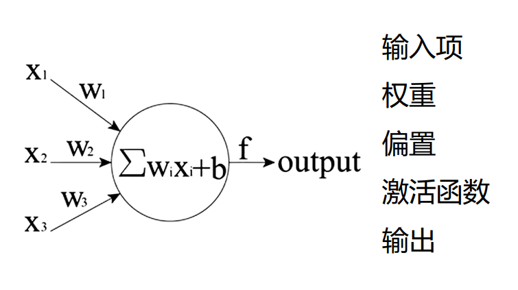

# [首页<<](../../index.html)

# 初识BP神经网络(一)
<meta name="viewport" content="width=device-width, initial-scale=1.0">
<meta name="keywords" content="BP神经网络,BP network,bigonion,Markdwon,Music" />
<meta name="author" content="bigonion,bigonion@bigonion.cn">
<meta name="description"
content="之前一直听说神经网络，但是从来没有真正做过，也不懂是啥玩意，今天让我们一起走进神经网络的世界！首先我们得知道神经网络的一个神经元是什么
+ 输入项$X_i$
首先必须有输入
+ 输入的权重$W_i$
表示这个输入的比重咋样，训练也是跳转这个比重
+ 输入偏置b
为啥要加上这个偏置呢，其实是为了能整体上下移动，增加拟合能力
+ 激活函数$f(x)$
就是防止数据太大而溢出的一个东西
+ 输出
这个没啥好说的...">

---

## 前言

之前一直听说神经网络，但是从来没有真正做过，也不懂是啥玩意，今天让我们一起走进神经网络的世界！  

---

## 神经元

首先我们得知道神经网络的一个神经元是什么
+ 输入项$X_i$
首先必须有输入
+ 输入的权重$W_i$
表示这个输入的比重咋样，训练也是跳转这个比重
+ 输入偏置b
为啥要加上这个偏置呢，其实是为了能整体上下移动，增加拟合能力
+ 激活函数$f(x)$
就是防止数据太大而溢出的一个东西
+ 输出
这个没啥好说的...

来，上图

## 正向传播

这啥玩意？其实就是给一个$X_i$ * $W_i$ + $b$
最后套一个$f(x)$ 变成 $f(X_i * W_i + b)$  
即 **给定权重 输入 偏置 最后算出来的输出的这个过程，我们就叫正向传播**

## 反向传播

好了，我们来看看反向传播吧！  
我们上面已经得到了输出 $f(X_i * W_i + b)$ 了对吧！  
那么我们拿这个输出  $f(X_i * W_i + b)$  去和目标输出做比较    

啥意思呢，如果我们给输出编个号，这个输出最后算出来的范围是0.2到0.4我们认为就是识别到了 大蒜，如果在0.4到0.6的范围内我们就认为是葱花

例如随便给一个W和b X=1的时候
 $f(X_1 * W_1 + b)$ = 0.3673
 我们认为这个输出更倾向于是大蒜，但是很明显，这个输入的东西它并不是大蒜，所以我们要对这个网络的W和b进行修正。

我们用当前输出和期望输出（大蒜的范围）做差   
$$0.3673 - 0.3=0.0673$$
那么这时候我们的偏差Err就是0.0673了，接下来我们对 $f(X_i * W_i + b)- k(目标值)$ 这个误差函数对$W_i$ 求偏导我们就可以得到$W_i$在这个网络中面对目标的方向是什么,其中的求偏导要用链式法则，仅仅只是计算方法而已

啥意思呢？举个例子  
$$f(x)=ax+b \\a=2,b=3,k=4\\st.期望输入x=1时候目标输出k=4$$
$x=1$时，$f(x)$=5 我们要让输出更接近4咋办，我们让f(x)-4对a求偏导，算出a的梯度方向，也就是
$$
  \frac{ \partial{ (f(x)-k)} }{ \partial a }=x
$$
我们输入$x$不就等于1吗，那这时候偏导就是1了，所以我们让a=a-1 他不就朝着目标前进了吗，此时

$$f(x)=ax+b \\a=2-1,b=3$$

$x=1$时 $f(x)=4$，这不就一下子输出4了吗，此时这个迷你网络就训练好了！....吗？
$$f(x)=ax+b \\a=1,b=3$$

是不是很有意思，虽然我们只迭代了一次，但却实实在在的朝着目标靠近了一步子，那不就是梯度的意义吗，在这里我们也要对b求偏导，再让
$$b=b-  \frac{ \partial{ (f(x)-4)} }{ \partial b }=b-1$$
嗯？怎么回事，这样b会变小，导致输出再度偏离我们的目标结果4，而变成3   
这就要引入学习率的这个参数了，我们步子一下跨的太大太大了，一下子就冲过了我们的目标点4，冲到了3，也就是步子迈太多了，我们需要控制我们的步子，所以我们给梯度乘上一个**系数**$\epsilon$ ,在这里我们假设为0.1吧

我们从头再来一次
$$f(x)=ax+b \\a=2,b=3$$
这次我们还是训练为希望输入x=1时候输出为k=4
$$
a=a-  0.1*\frac{ \partial{ (f(x)-k)} }{ \partial a }=a-0.1
$$
$$
b=b-  0.1*\frac{ \partial {(f(x)-k)} }{ \partial b }=b-0.1
$$
$$
f(x)=1.9x+2.9 
$$
$x=1$时$f(1)=4.8$
天啊！成功朝着目标前进了一步，上一次明显是走过头了，这一次的效果就非常好！
我们再反复多来几次，直到误差不收敛（不再变小而是疯狂在目标值范围振动的时候）这表明学习率（步子）又大了，我们继续缩小步子，再一步逼近目标点4，最后多迭代计算几次，我们就能得到想要的神经网络参数a,b了！

[推荐观看](https://www.bilibili.com/video/BV1yG411x7Cc/?spm_id_from=333.337.search-card.all.click&vd_source=347109678632e4593a175ba64105c5ff)

---

## 总结
本文浅显的谈了谈BP神经网络大概是啥东西，有可能有些地方讲得不对，希望大家指正

---

## 关于

作者：bigonion
邮箱：bigonion@bigonion.cn  

NameSpace: [bigonion.cn](https://bigonion.cn)   
Origin: [bigonion.cn/blog](https://bigonion.cn/blog)    
Powered by [md.bigonion.cn](https://bigonion.cn/blog)   

声明：未经本人同意，禁止转载、搬运、抄袭！  

TIME:2023 4.22 15:07